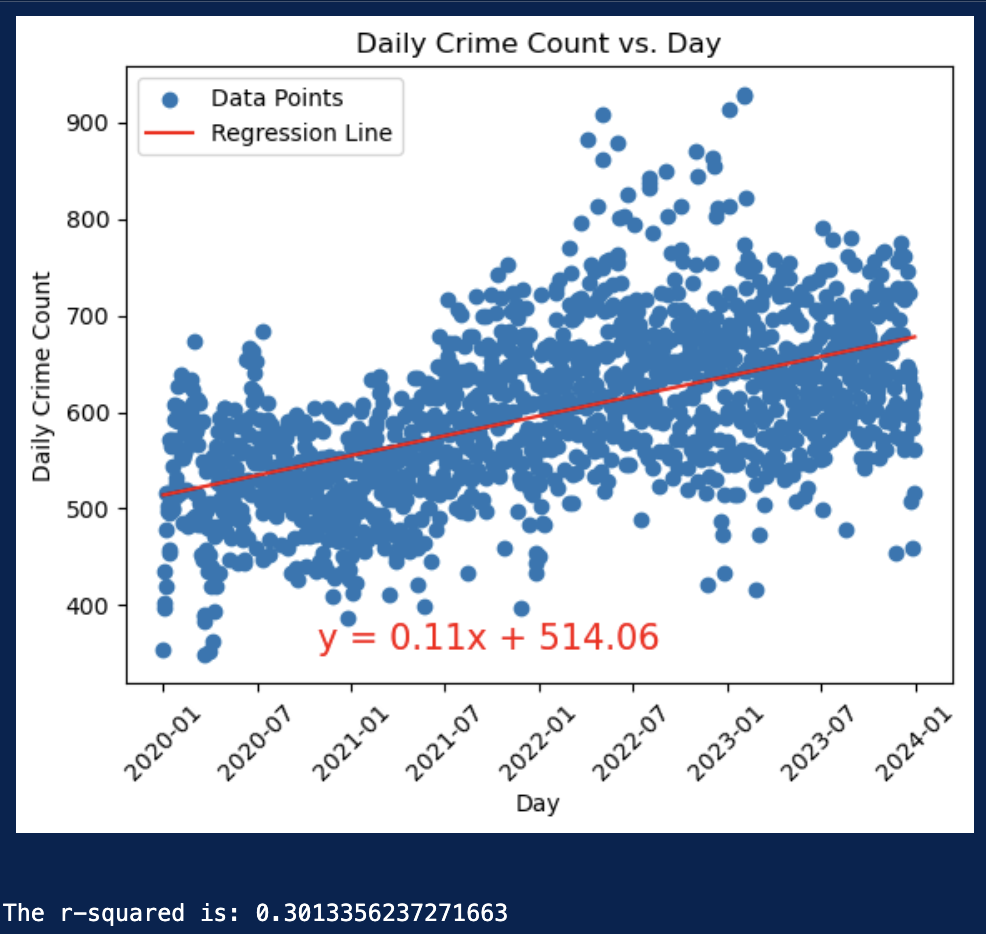
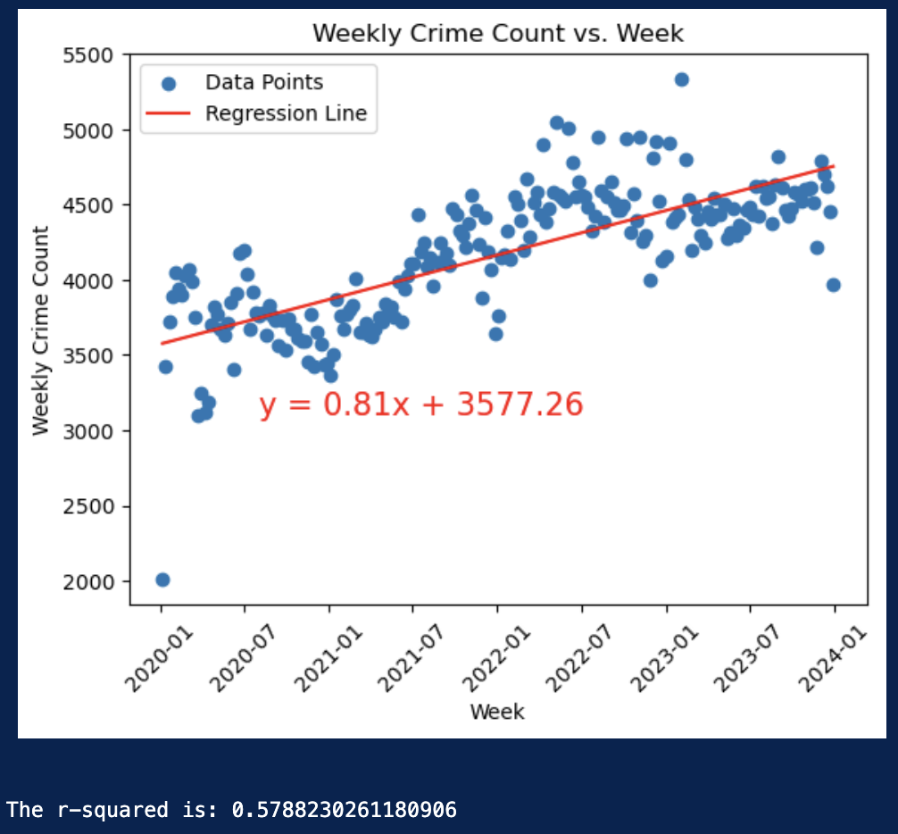
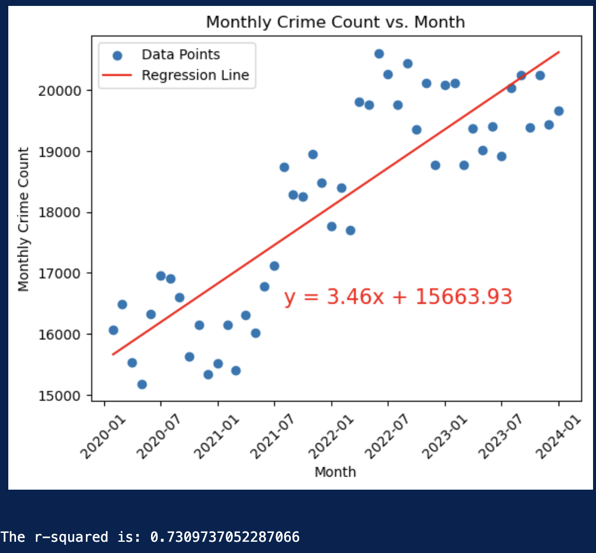
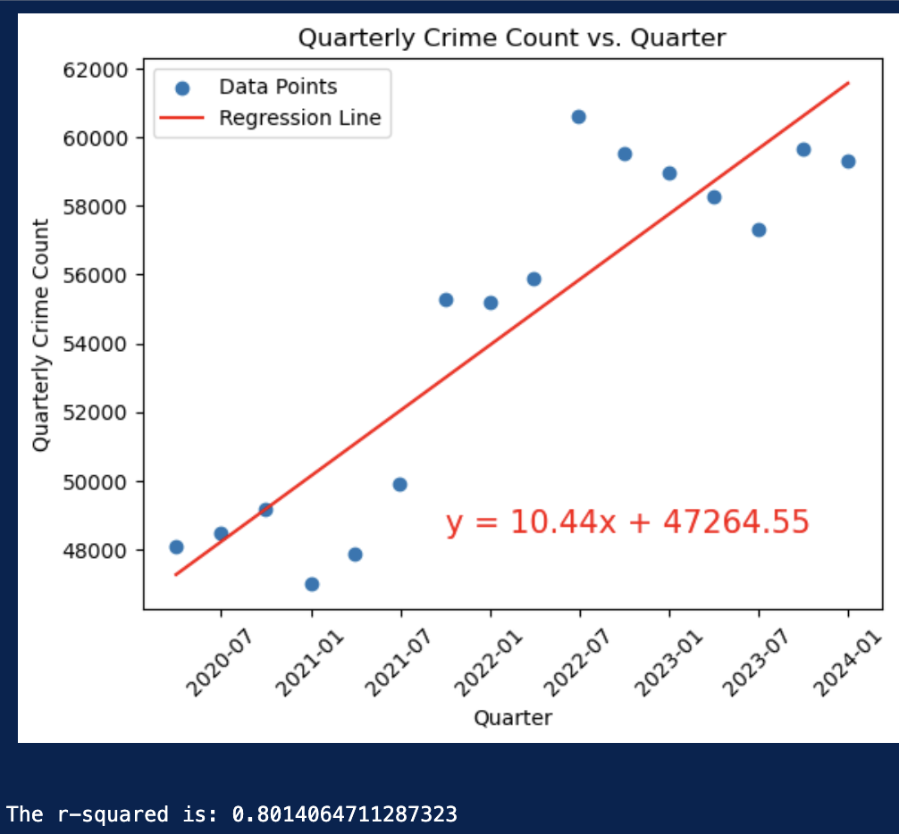
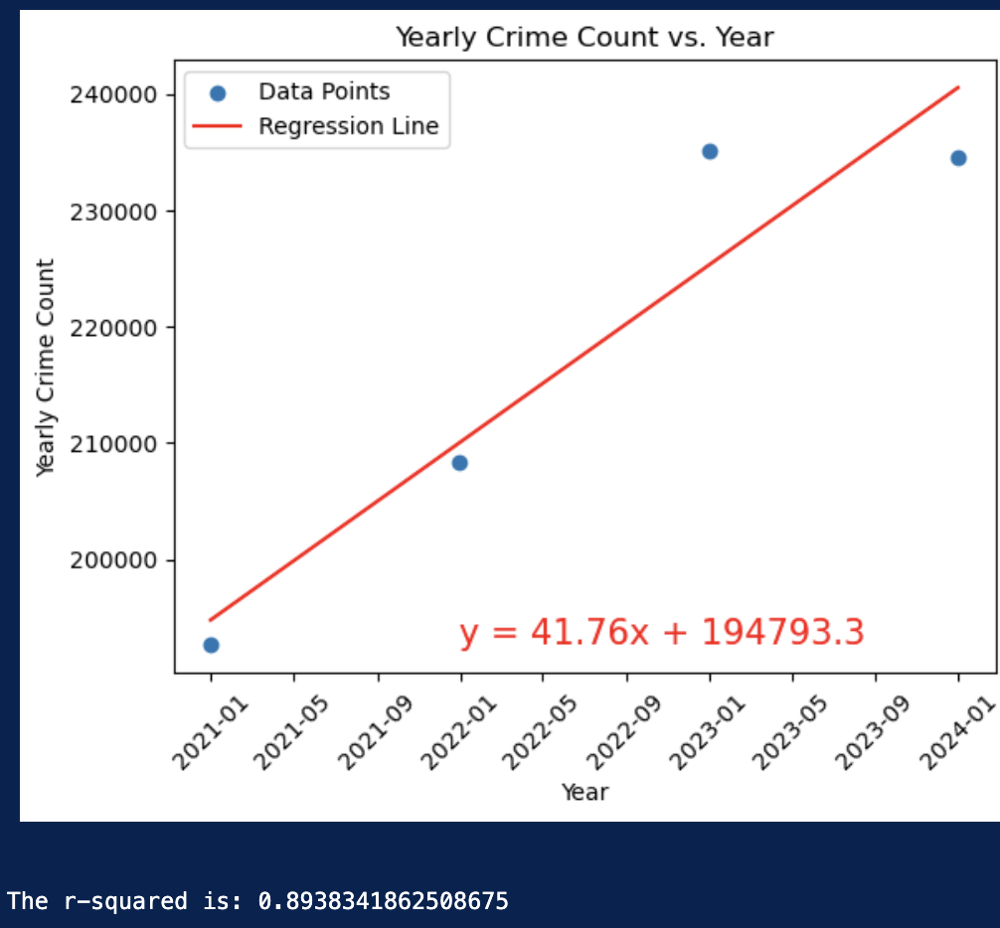
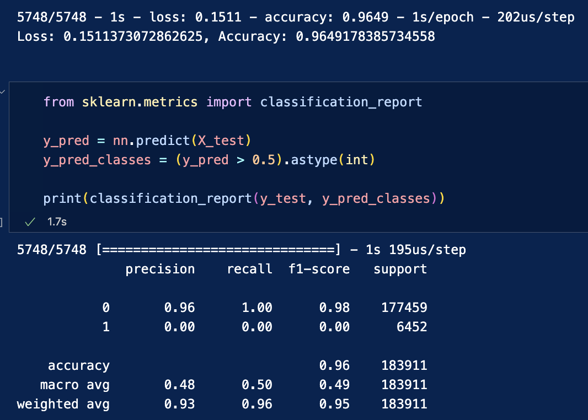
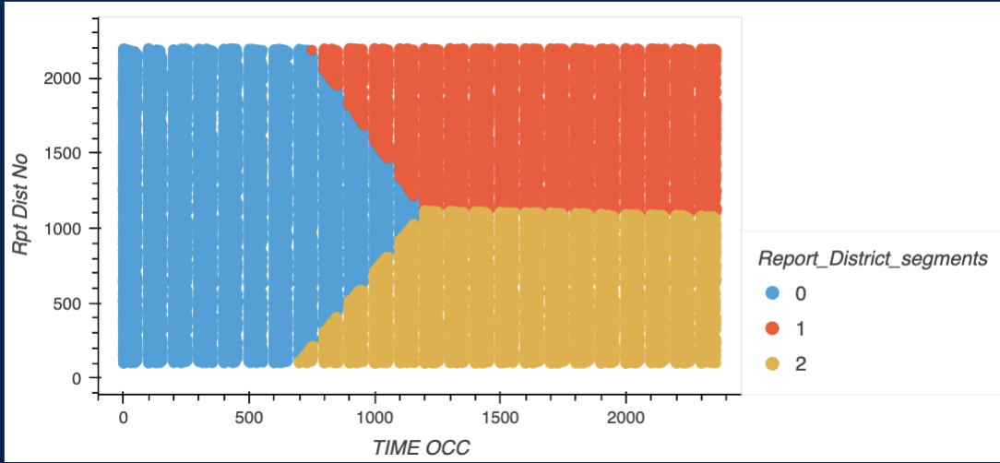

# project_four
Project 4 - Los Angeles Crime Report 2022 - 2024

Our dataset consists of 
- Total number of crime records: 1,005,104
- Total number of crime codes: 141

# Key Findings:

- Homicides are most frequently happens between 9 PM and 2 AM. With another peak at 2PM. The 4th day of the month showed the highest number of homicides over the five years studied. And Weekends has highest rate of it among whole week.

- Human Abduction & Trafficking peak at 12 PM.

- Physical & Psychological Abuse incidents decrease significantly between 3 AM and 7 AM only. With the highest rate on Weekends among all other days of the week.

- Sex Offenses (Forcible & Non-Forcible) occur most often at 12 AM and 12 PM.

- The 1st day of every month records 2–3 times more crimes than any other day, with a notable rise in violent offenses.

- No significant correlation was found between crime rates and moon phases, but a pattern emerges around seasonal solar events (Spring, Summer, Fall, and Winter Equinoxes), where crime rates frequently spike on or immediately after these dates.

# Visualizations
[Tableau Public](https://public.tableau.com/app/profile/anya.bocharova/viz/LA_Crime_Viz/Story1)

# Linear Regression
Linear Regression proved to be the only model, that when applied to the dataset, rendered an R-squared value greater than 0.80 (or a classification accuracy greater than 75%). Data was processed to summarize crime occurances until the r-squared value exceeded 0.80. 

Daily, weekly, and monthly summarries did not produce a high enough r-squared. The quarterly totals on crime activity yielded 0.8014 r-squared value. While the yearly summations yielded a higher r-squared value, the loss of detail did not justify its use.

---

---

---

---

# Predictive Modeling with Neural Networks, k-means and Confusion Networks did not work
## Neural Networks
Predictive models were created to improve response times and allocate specialized resources for vulnerable populations. Using data from 1/2020 - 2/2025 a deep learning neural network was used to build a model that predicts that the victim of a report, call or crime is a minor (under 18) or senior (over 70) at accuracies of 96.5% and 95.7% respectively. 

These results were exciting and promising, but further investigation revieled that these networks (and others that tested for arrest as an outcome, gender of victims, or identifying violent crime) were ineffective. The models would exclude the smaller outcome and instead use chance to predict. 

### For example:
When identifying a minor was the probable victim of a crime (2.5% of the crime in the dataset), the model was 96.5% accuate. It achieved this by excluding the data pertaining to minors as victims. It essentially would identify all cases as having a non-minor as a victim and would be correct 96.5% of the time!

 

This is a clear example of results found in all of the models that utilized machine learning with this dataset. In the image above, class "1" is given 0.00 weight in training the model! When attempting to weight the model to oversample the minority data, accuracy plumetted to 24-30%. 

Eventially other models were attempted with odd, unusable results. Below is an example of using PGA and k-means testing to categorize the data. While the flag shape is interesting, the segmentation of useless as the x-axis was time. For this data model to be useful, certain criminal activity would start and stop at different moments.

### What is going on?
It turns out that records of crimes are nearly random. There are trends and clusters of activity, but human behavior is too complex to accurately model at this scale. Multiple researchers have found it difficult to improve a neural network model of criminal activity beyond 16.4% accuracy. This same study attempted to implement the same structured network (using latitude, longitude, and time of day) as our team attempted. [citation](https://www.frontiersin.org/journals/psychology/articles/10.3389/fpsyg.2021.587943/full)

LAPD recently implemented a predictive model using this very dataset (probably with additional datapoints used) and discontinued its use due to it reinforcing stereotypes instead of accurately modeling and predicting actual criminal activity. [citation](https://www.theguardian.com/us-news/2021/nov/07/lapd-predictive-policing-surveillance-reform)

# Note
This research is conducted purely for analytical and educational purposes and does not serve as an official crime report. The findings are subject to change as new data becomes available.

# Authors
- Anya Bocharova, 2025
[@AnyaBoch](https://github.com/AnyaBoch)

- Holly Bourgeois, 2025
[@hbourgeois](https://github.com/hbourgeois)

- Andrew Lane, 2025 
[@andrewplane](https://github.com/andrewplane)

## General information

### Part I 
Offenses Part I offense classifications include (in this particular order): 

**1. Criminal homicide**―

a. **Murder and nonnegligent manslaughter**: 

the willful (nonnegligent) killing of one human being by another. Deaths caused by negligence, attempts to kill, assaults to kill, suicides, and accidental deaths are excluded. 
The program classifies justifiable homicides separately and limits the definition to: (1) the killing of a felon by a law enforcement officer in the line of duty; or (2) the killing of a felon, during the commission of a felony, by a private citizen. 

b. **Manslaughter by negligence**: the killing of another person through gross negligence. Deaths of persons due to their own negligence, accidental deaths not resulting from gross negligence, and traffic fatalities are not included in the category manslaughter by negligence.

**2. Rape**―

The penetration, no matter how slight, of the vagina or anus with any body part or object, or oral penetration by a sex organ of another person, without the consent of the victim.

**3. Robbery**―

The taking or attempting to take anything of value from the care, custody, or control of a person or persons by force or threat of force or violence and/or by putting the victim in fear.

**4. Aggravated assault**―

An unlawful attack by one person upon another for the purpose of inflicting severe or aggravated bodily injury. This type of assault usually is accompanied by the use of a weapon or by means likely to produce death or great bodily harm. Simple assaults are excluded.

**5. Burglary (breaking or entering)**―

The unlawful entry of a structure to commit a felony or a theft. Attempted forcible entry is included.

**6. Larceny** -

theft (except motor vehicle theft)―The unlawful taking, carrying, leading, or riding away of property from the possession or constructive possession of another. Examples are thefts of bicycles, motor vehicle parts and accessories, shoplifting, pocket-picking, or the stealing of any property or article that is not taken by force and violence or by fraud. Attempted larcenies are included. Embezzlement, confidence games, forgery, check fraud, etc., are excluded.

**7. Motor vehicle theft**―

The theft or attempted theft of a motor vehicle. A motor vehicle is self-propelled and runs on land surface and not on rails. Motorboats, construction equipment, airplanes, and farming equipment are specifically excluded from this category.

**8. Arson** ―

Any willful or malicious burning or attempt to burn, with or without intent to defraud, a dwelling house, public building, motor vehicle or aircraft, personal property of another, etc.
Human Trafficking, commercial sex acts—Inducing a person by force, fraud, or coercion to participate in commercial sex acts, or in which the person induced to perform such act(s) has not attained 18 years of age.
**Human Trafficking, involuntary servitude—The obtaining of a person(s) through recruitment, harboring, transportation, or provision, and subjecting such persons by force, fraud, or coercion into involuntary servitude, peonage, debt bondage, or slavery (not to include commercial sex acts).

Part II 

Offenses Part II offenses encompass all other reportable classifications outside those defined as Part I. Law enforcement agencies report to the FBI only arrest data involving the Part II crimes: 

**9. Other Assaults** - 

Assaults and attempted assaults where no weapon was used or no serious or aggravated injury resulted to the victim. Stalking, intimidation, coercion, and hazing are included. 

**10. Forgery and Counterfeiting** - 

The altering, copying, or imitating of something, without authority or right, with the intent to deceive or defraud by passing the copy or thing altered or imitated as that which is original or genuine; or the selling, buying, or possession of an altered, copied, or imitated thing with the intent to deceive or defraud. Attempts are included.

**11. Fraud** - 

The intentional perversion of the truth for the purpose of inducing another person or other entity in reliance upon it to part with something of value or to surrender a legal right. Fraudulent conversion, obtaining of money or property by false pretenses, confidence games, and bad checks, except forgeries and counterfeiting, are included.

**12. Embezzlement** - 

The unlawful misappropriation or misapplication by an offender to his/her own use or purpose of money, property, or some other thing of value entrusted to his/her care, custody, or control.

**13. Stolen Property: Buying, Receiving, Possessing** - 

Buying, receiving, possessing, selling, concealing, or transporting any property with the knowledge that it has been unlawfully taken, as by burglary, embezzlement, fraud, larceny, robbery, etc. Attempts are included.

**14. Vandalism** -

 To willfully or maliciously destroy, injure, disfigure, or deface any public or private property, real or personal, without the consent of the owner or person having custody or control by cutting, tearing, breaking, marking, painting, drawing, covering with filth, or any other such means as may be specified by local law. Attempts are included.

**15. Weapons: Carrying, Possessing, etc.**

**16. Prostitution and Commercialized Vice** - 

The unlawful promotion of or participation in sexual activities for profit.

**17. Sex Offenses** (except rape, prostitution, and commercialized vice)- Offenses against chastity, common decency, morals, and the like.

**18. Drug Abuse Violations** - 

The violation of laws prohibiting the production, distribution, and/or use of certain controlled substances. The unlawful cultivation, manufacture, distribution, sale, purchase, use, possession, transportation, or importation of any controlled drug or narcotic substance. Arrests for violations of state and local laws, specifically those relating to the unlawful possession, sale, use, growing, manufacturing, and making of narcotic drugs. The following drug categories are specified: opium or cocaine and their derivatives (morphine, heroin, codeine); marijuana; synthetic narcotics―manufactured narcotics that can cause true addiction (Demerol, methadone); and dangerous nonnarcotic drugs (barbiturates, Benzedrine).

**19. Gambling** - 

To unlawfully bet or wager money or something else of value; assist, promote, or operate a game of chance for money or some other stake; possess or transmit wagering information; manufacture, sell, purchase, possess, or transport gambling equipment, devices, or goods; or tamper with the outcome of a sporting event or contest to gain a gambling advantage.

**20. Offenses Against the Family and Children** - 

Unlawful nonviolent acts by a family member (or legal guardian) that threaten the physical, mental, or economic well-being or morals of another family member and that are not classifiable as other offenses, such as assault or sex offenses. Attempts are included.

**21. Driving Under the Influence** -

 Driving or operating a motor vehicle or common carrier while mentally or physically impaired as the result of consuming an alcoholic beverage or using a drug or narcotic.

**22. Liquor Laws** - 

The violation of state or local laws or ordinances prohibiting the manufacture, sale, purchase, transportation, possession, or use of alcoholic beverages, not including driving under the influence and drunkenness. Federal violations are excluded.

**23. Drunkenness** -

 To drink alcoholic beverages to the extent that one’s mental faculties and physical coordination are substantially impaired. Driving under the influence is excluded.

**24. Disorderly Conduct** - 

Any behavior that tends to disturb the public peace or decorum, scandalize the community, or shock the public sense of morality.

**25. Vagrancy** - 

The violation of a court order, regulation, ordinance, or law requiring the withdrawal of persons from the streets or other specified areas; prohibiting persons from remaining in an area or place in an idle or aimless manner; or prohibiting persons from going from place to place without visible means of support.

**26. All Other Offenses** - 

All violations of state or local laws not specifically identified as Part I or Part II offenses, except traffic violations
.
**27. Suspicion**- 

Arrested for no specific offense and released without formal charges being placed.

**28. Curfew and Loitering Laws—(Persons under 18)** - Violations by juveniles of local curfew or loitering ordinances.

**29. Runaways—(Persons under 18)**

### Credits

Project dataset:

https://data.lacity.org/Public-Safety/Crime-Data-from-2020-to-Present/2nrs-mtv8/about_data

The following links were used to understand type of crimes and create manual mapping for subcategories::
https://lasd.org/transparency/part1and2crimedata/
https://ucr.fbi.gov/crime-in-the-u.s/2019/crime-in-the-u.s.-2019/topic-pages/offense-definitions
https://ucr.fbi.gov/nibrs/2011/resources/nibrs-offense-codes

Full Moon Calendar was created created by Griffith Observatory using USNO MICA software and NASA/JPL Horizons Web Portal (Pacific Time Zone):
https://griffithobservatory.org/explore/observing-the-sky/whats-in-the-sky/the-moon/2020-phases-of-the-moon/
https://griffithobservatory.org/explore/observing-the-sky/whats-in-the-sky/the-moon/2021-phases-of-the-moon/
https://griffithobservatory.org/explore/observing-the-sky/whats-in-the-sky/the-moon/2022-phases-of-the-moon/
https://griffithobservatory.org/explore/observing-the-sky/whats-in-the-sky/the-moon/2023-phases-of-the-moon/
https://griffithobservatory.org/explore/observing-the-sky/whats-in-the-sky/the-moon/2024-phases-of-the-moon/